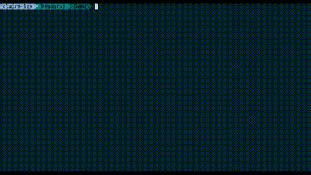

```
-------------------------------------------------------------------------------
                  ,__ __                                      
                 /|  |  |                                     
                  |  |  |   _   __,  __,   __,  ,_    _    _  
                  |  |  |  |/  /  | /  |  /  | /  |  |/  |/ \_
                  |  |  |_/|__/\_/|/\_/|_/\_/|/   |_/|__/|__/ 
                                 /|         /|          /|    
                                 \|         \|          \|    

-------------------------------------------------------------------------------
```

Megagrep helps beginning a code review by searching for patterns in the code
using "grep". **It does not search for vulnerabilities directly but for places
where you could manually find some**.

Megagrep searches for patterns in the code that require to be investigated
manually for security issues. It uses several search modes (keyword-based,
strings or comments extraction) and outputs either detailed results or global
information to discover the code and locate interesting pieces of code (most
frequent keywords, files with the most results, etc.).

This is not *really* a security-focused static analysis tool. Patterns are
intentionally not too restrictive and will probably trigger false positives, but
to figure it out you have to... review all suspicious pieces of code :). In
other words, Megagrep will give you **locations** (where you could find
vulnerabilities), not vulnerabilities directly.

If you want a grep-based static analysis tool for direct vulnerability research,
you can check [Graudit](https://github.com/wireghoul/graudit).




- [Getting Started](#getting-started)
- [How to begin a code review with Megagrep](#how-to-begin-a-code-review-with-megagrep)
    1. [Tree and code discovery](#tree-and-code-discovery)
    2. [Keywords-based search](#keywords-based-search)
    3. [Other search modes](#other-search-modes)
    4. [Print and save results](#print-and-save-results)
    5. [Improve Megagrep results](#improve-megagrep-results)
        - [Use and write dictionaries](#use-and-write-dictionaries)
- [Coming soon](#coming-soon)

Getting Started
---------------

Clone repository:

```
https://github.com/claire-lex/megagrep
```

(Optional) Install requirements to improve terminal output (nice text and colors):

```
pip install -r requirements.txt
```

Run with standard options and default dictionary on a directory:
```
python megagrep.py /path/to/my/code
```

Store results to a file:
```
python megagrep.py my_directory -f megagrep.out
```

Print help:
```
python megagrep.py -h
```

How to begin a code review with Megagrep
----------------------------------------

### Tree and code discovery

When starting a code review, you often have a huge amount of code in a deep and
messy directory tree, and you don't know where to start. You can use Megagrep to
have a general idea with statistics (`-S`) of what the code contains, what you
may find and where:

```
$> python -S -x "*.js"
[...]
--------------------------- Most frequent keywords ----------------------------
  1. login (21)
  2. passw*d (11)
  3. session (9)
  4. sql (8)
  5. auth* (4)
  6. upload (3)
  7. sha*1 (3)
  8. download (3)
  9. md5 (2)
 10. exec (2)
--------------------------- Files with most results ---------------------------
  1. /path/to/index.php (20)
  2. /path/to/classes/Login.php (14)
  3. /path/to/templates/fonts/fontawesome-webfont.svg (12)
  4. /path/to/templates/loginform.php (8)
  5. /path/to/config.php (3)
  6. /path/to/templates/logged.php (1)
  7. /path/to/templates/include/header.php (1)
  8. /path/to/templates/edit.php (1)
[...]
```

The ls mode (`-L`) helps you locate directories you may want to browse:

```
python megagrep -L
[...]
|-- .
|-- config.php
|   <  2 results | Top: sql, login >
|-- index.php
|   <  20 results | Top: login, session, auth* >
|-- classes
|   | -- Login.php
|   |    <  12 results | Top: sql, login, exec >
|-- templates
|   | -- logged.php
|   |    <  1 results | Top: md5 >
|   | -- loginform.php
|   |    <  4 results | Top: login, auth* >
|   | -- css
|   | -- fonts
|   | -- images
|   | -- include
|   |    | -- header.php
|   |    |    <  1 results | Top: query >
|   | -- js
[...]
```

> This mode can be combined (though not necessarily relevant) with comment and
  string mode.

### Keywords-based search

By default, Megagrep outputs a list of lines containing keywords from its own
default dictionary.

```
$> python megagrep.py .
[...]
classes/Login.php:51: public static function checkAuth($bank_id, $password) { (auth*, passw*d)
classes/Login.php:52: $conn = new PDO(DB_DSN, DB_USERNAME, DB_PASSWORD); (passw*d)
classes/Login.php:53: $sql = "SELECT * FROM users WHERE bank_id='".$bank_id; (sql)
classes/Login.php:54: $sql = $sql."' AND password='".md5($password)."';"; (sql, md5, passw*d)
classes/Login.php:56: $st = $conn->prepare($sql); (sql)
classes/Login.php:57: $st->execute(); (exec)
[...]
```

The extended output option `-e` prints lines before and after matching line:

```
$> python megagrep.py -e .
[...]
-------------------------------------------------------------------------------
classes/Login.php:52: $conn = new PDO(DB_DSN, DB_USERNAME, DB_PASSWORD);
classes/Login.php:53: $sql = "SELECT * FROM users WHERE bank_id='".$bank_id; (sql)
classes/Login.php:54: $sql = $sql."' AND password='".md5($password)."';";
-------------------------------------------------------------------------------
classes/Login.php:53: $sql = "SELECT * FROM users WHERE bank_id='".$bank_id;
classes/Login.php:54: $sql = $sql."' AND password='".md5($password)."';"; (md5, passw*d, sql)
classes/Login.php:55: 
-------------------------------------------------------------------------------
classes/Login.php:55: 
classes/Login.php:56: $st = $conn->prepare($sql); (sql)
classes/Login.php:57: $st->execute();
-------------------------------------------------------------------------------
[...]
```

You can also search for keywords only in file names with option `-N`:

```
$>python megagrep.py -N
[...]
classes/Login.php:0: Login.php - /path/to/classes/Login.php (login)
templates/loginform.php:0: loginform.php - /path/to/templates/loginform.php (login)
```

To search **in specific files**, the include (`-i`) and exclude (`-x`) options
can be used.

To search **for specific keywords**, option `-w` can be used to search specific
words directly (alone or combined with a dictionary):

```
$> python megagrep.py -w bad,wrong # Search for words "bad" and "wrong" only
$> python megagrep.py -w bad -d my_dict # Search for "bad" and the content of my_dict
```

Finally, you can use your own dictionary file with `-d` (see below for syntax
examples) or use part of a dictionary with `-l` to select a section (ex:
`authentication`).

### Other search modes

Megagrep includes modes to extract strings (`-T`) and comments (`-C`) from the
code.

```
$> python megagrep.py -T -i "*.php"
[...]
config.php:6: define("DB_DSN", "mysql:host=localhost;dbname=testo"); (mysql:host=localhost;dbname=testo, DB_DSN)
config.php:7: define("DB_USERNAME", "root"); (DB_USERNAME, root)
config.php:8: define("DB_PASSWORD", "P@$$w0rd"); (DB_PASSWORD, P@$$w0rd)
config.php:9: define("CLASS_PATH", "classes"); (classes, CLASS_PATH)
config.php:10: define("TEMPLATE_PATH", "templates"); (TEMPLATE_PATH, templates)
[...]
```

Comments mode will search for one-line comments starting with `//` and `#` and
for C-style comments (`/* ... */`, on one or multiple lines). One can also
choose a custom tag to use with option `-t`

```
$> python megagrep.py -C -t % -i "*.sty"
[...]
mybeamertheme.sty:3: % Requirement (Requirement)
mybeamertheme.sty:10: % TODO (TODO)
[...]
```

### Print and save results

Megagrep outputs results as colored text to stdout if `termcolor` is installed,
or as raw text. Results can also be printed as CSV with options `-c`.

```
$> python megagrep.py -c -i "*.php" 
[...]
Login.php,51,public static function checkAuth($bank_id, $password) {,auth*,,,/path/to/classes/Login.php
Login.php,53,$sql = "SELECT * FROM users WHERE bank_id='".$bank_id;,sql,,,/path/to/classes/Login.php
Login.php,54,$sql = $sql."' AND password='".md5($password)."';";,sql|md5,,,/path/to/classes/Login.php
Login.php,56,$st = $conn->prepare($sql);,sql,,,/path/to/classes/Login.php
Login.php,57,$st->execute();,exec,,,/path/to/classes/Login.php
[...]
```

The option `-f` can be used to store results to a file (`-c` and `-f` can be
combined).

### Improve Megagrep results

#### Use and write dictionaries

You can use default dictionaries in ``dicts/`` and also use your own:

```
python megagrep.py -d path/to/dictionary
```

A dictionary has the following format:

```
# Comment line

[list_name]
keyword1
keyword2 # Comment at the end
matching_keyw*d
```

Example:

```
# Global keywords

[authentication]
auth* # authentication and authorization stuff
login
passw*d
pwd
session
admin*
```

Coming soon
-----------

* Add better dictionaries (help welcome!)
* Improve "stat" mode content (ideas welcome!)
* Detext multi-line C-style comments with option `-C`
* Add direct regex support in dictionaries with prefix `regex:`
* Export results as HTML
